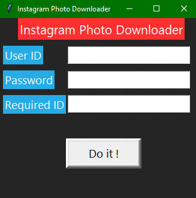

# Instagram-Photo-Downloader
A python script to download all photos of the person whom you follow

Use it for personal use only.

Do not misuse.

You will need :-

    a) chromedriver
        Set path for your chromedriver in Environment Variables
        It is available here - https://sites.google.com/a/chromium.org/chromedriver/downloads
        
    b) Python 3.x 
        Link - https://www.python.org/downloads/
        Download 3.x version
        Open Installation folder
        then open Script folder and copy address of pip file
        Set environment variable to this location (Path)
        For adding multiple Path, separate each path by a comma ( , )
        
    c) Selenium
        For installing it open cmd and type
                pip install selenium
                
    d) Requests
        For installing it open cmd and type
                pip install requests
       
